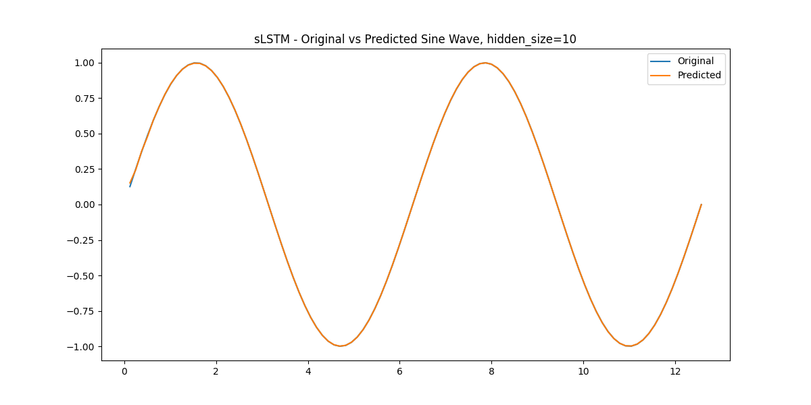

Paper implementation of the memory cells sLSTM and mLSTM as well as the xLSTM architecture presented in [xLSTM: Extended Long Short-Term Memory](https://arxiv.org/abs/2405.04517).

# Initial Results

Results on an sine wave with 5 hidden units and 500 epochs.

## sLSTM

## mLSTM

# To Do

- [X] Check implementation of mLSTM - seems somewhat off
- [ ] Implement xLSTM - stack Cells together
